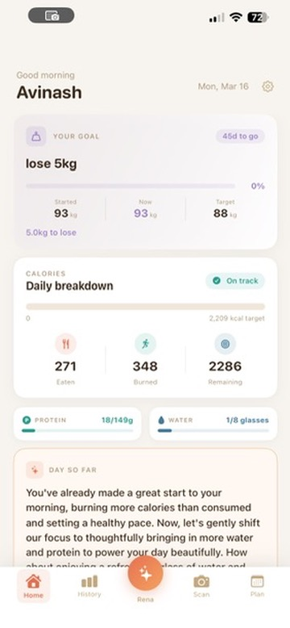
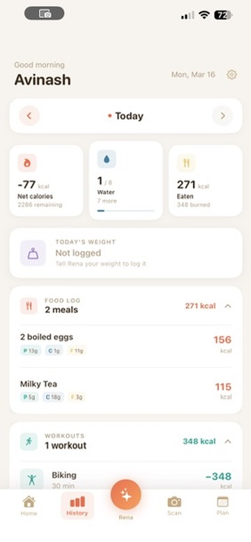
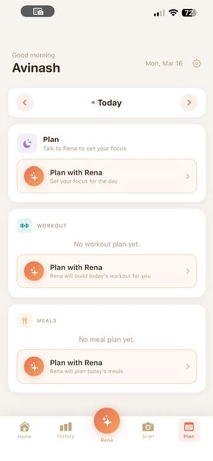
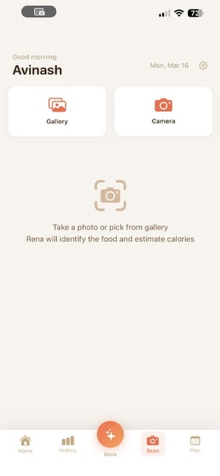

# Rena — Building an AI Health Companion with Gemini Live

> **Challenge:** Gemini Live Agent Challenge 2026
> **Category:** Live Agents
> **Live app:** https://rena-490107-f0f28.web.app
> **Repo:** https://github.com/aag1091-alt/Rena

---

## What is Rena?

Rena is a personal AI health companion built around one idea: *you should never feel like you're logging data*. Most health apps fail because tracking is a chore — you have to open the app, find the right screen, type or tap in numbers, and repeat dozens of times a day.

Rena flips this with voice-first interaction powered by **Gemini Live**. You just talk:

- *"I had salmon, rice, and sparkling water for lunch"*
- *"Add bodyweight squats to my workout plan"*
- *"What's my calorie budget for dinner?"*
- *"Plan my meals for tomorrow — I have a long run in the morning"*

Rena listens, understands, and takes action — logging the meal, building the plan, answering with context — all through natural conversation.

The app was built in under two weeks for the hackathon and is deployed and working today.

---

## The Core Idea: Your Goal, Your Timeline

When you first open Rena, she asks one question — *"What are you working toward?"*

You answer in your own words:
- *"I want to feel confident at my friend's wedding in July"*
- *"Beach trip in 10 weeks"*
- *"I want to run a half marathon in October"*

Rena sets a countdown, understands your timeline, and becomes a daily companion working toward that one specific goal. Everything she recommends — food suggestions, workout plans, morning nudges — is filtered through what you're actually working toward, not a generic calorie number.

As part of onboarding, you can share an inspiration photo and Rena generates a **personal vision board** using Imagen — a visual that's tied to your real metrics and evolves as you make progress.

---

## Features

### Home — goal dashboard



The home screen shows your goal countdown, daily calorie breakdown (eaten / burned / remaining), protein and water progress, and an AI-generated "Day so far" insight that Gemini writes fresh each morning from your actual logged data.

### Voice logging (Gemini Live)
Talk to Rena naturally from any screen. Each tab opens a context-aware voice session:
- **Home tab** — log food, water, workouts, or check today's progress
- **History tab** — ask about past entries, remove logs by voice
- **Plan tab** — generate or update your workout plan and meal plan
- **Scan tab** — describe what you're looking at after scanning

### History — daily log & AI insights



The History tab shows a scrollable day log with every meal (including macros), workout with calories burned, and water intake. Each day has an AI-generated insight and activity summary written by Gemini from your actual data.

### Plan — workout & meal planning



The Plan tab shows your workout plan and meal plan side by side. Tap "Plan with Rena" to open a voice session — Rena will generate a full workout or meal plan through conversation, calibrated to your goal and recent history.

### Food scan (Gemini Vision)



Point your camera at a plate or pick from your gallery. Rena identifies every food item, returns per-item calorie and macro estimates with confidence levels, and lets you adjust quantities with a slider before logging.

### AI-generated workout plans
Say *"plan my workout for today"* and Rena generates a complete workout plan tailored to your goal, fitness level, and recent activity history using Gemini 2.5 Flash. Exercises include sets, reps, duration, target muscles, and calorie estimates.

### AI-generated meal plans
*"Plan my meals for tomorrow — I have a work lunch"* — Rena generates a full day of meals calibrated to your exact calorie and protein targets, with cook time estimates and recipe context.

### Tomorrow planning + morning nudge
Tap "Plan tomorrow" before bed. Rena asks about your commitments, workout preference, and food plans — then saves a summary. Next morning, your home screen shows a personalized nudge generated from what you told Rena the night before.

### AI exercise demonstration videos
Exercises in your workout plan have a ▶ button. For supported exercises, Rena generates an AI coaching video using **Veo 2** — a trainer demonstrating the movement with Rena's voice coaching you through the reps. Other exercises link to YouTube.

### History & AI insights
The History tab shows a scrollable log of every day. Each day has an AI-generated insight ("You hit your protein goal 5 days in a row — your recovery workouts are paying off") and an activity summary, generated by Gemini from your actual data.

---

## Technologies Used

### AI & Machine Learning
| Technology | How it's used |
|---|---|
| **Gemini Live API** | Real-time bidirectional voice streaming — the core of all voice interaction |
| **Gemini 2.5 Flash** (`gemini-2.5-flash-native-audio-latest`) | Agent reasoning, plan generation, day insights, coaching scripts |
| **Gemini Flash Vision** | Food photo recognition — identifies items, returns nutrition estimates |
| **Veo 2** | AI-generated exercise demonstration videos |
| **Imagen** | Vision board image generation on goal setup |
| **Google Agent Development Kit (ADK)** | Agent framework — tools, routing, session management |
| **Google Cloud TTS** (`en-US-Neural2-F`) | Rena's coaching voiceover for exercise videos |

### Infrastructure
| Service | Role |
|---|---|
| **Cloud Run** | Hosts the Rena agent (min 1 instance to avoid cold-start voice drops) |
| **Firestore** | All user data — logs, plans, goals, prompts, insights, video jobs |
| **Cloud Storage** (`rena-assets`) | Exercise videos + vision board images |
| **Firebase Hosting** | PWA web companion |
| **Cloud Build** | CI/CD — GitHub push triggers build + deploy to Cloud Run |

### Application
| Layer | Tech |
|---|---|
| **iOS app** | SwiftUI, AVAudioEngine, AVQueuePlayer, URLSessionWebSocketTask |
| **Web PWA** | Vanilla JS, Web Audio API + AudioWorklet, WebSocket, Service Worker |
| **Backend** | Python, FastAPI, Google ADK, WebSocket (bidirectional audio) |

---

## Architecture

```
┌──────────────────────────────────────────────────────────────────┐
│                        iOS App (SwiftUI)                         │
│                                                                  │
│  ┌──────────┐  ┌──────────┐  ┌────────────┐   ┌───────────────┐  │
│  │  Home    │  │ History  │  │    Plan    │   │  Scan/Camera  │  │
│  │          │  │ Workbook │  │  Workout + │   │               │  │
│  │          │  │ Insights │  │  Meal Plan │   │               │  │
│  └────┬─────┘  └────┬─────┘  └─────┬──────┘   └──────┬────────┘  │
└───────┼─────────────┼──────────────┼─────────────────┼───────────┘
        │ WebSocket   │ REST         │ REST            │ REST
        │ (audio)     │ (insights)   │ (plans/video)   │ (scan/log)
┌───────▼─────────────▼──────────────▼─────────────────▼─────────────┐
│                      Rena Agent (Cloud Run)                        │
│                                                                    │
│  ┌──────────────────────────────────────────────────────────────┐  │
│  │                  Gemini ADK — Agent Core                     │  │
│  │  Voice tools:                    Plan tools:                 │  │
│  │  • log_meal / delete_meal        • generate_workout_plan     │  │
│  │  • log_water / remove_water      • generate_meal_plan        │  │
│  │  • log_workout / delete_workout  • get_meal_plan             │  │
│  │  • log_weight                    • log_meal_from_plan        │  │
│  │  • scan_image                    • log_exercise_from_plan    │  │
│  │  • get_progress                  • save_tomorrow_plan_note   │  │
│  │  • set_goal                      • get_recent_workouts       │  │
│  └──────────────────────────────────────────────────────────────┘  │
│                                                                    │
│  ┌──────────────────────────────────────────────────────────────┐  │
│  │  Context prompt system                                       │  │
│  │  • Prompts stored in Firestore (prompts/{context_key})       │  │
│  │  • Injected at session start with [RENA MEMORY] block        │  │
│  │  • Per-tab contexts: home, history, scan, workout_plan,      │  │
│  │    update_workout_plan, meal_plan, plan, goal, intro         │  │
│  │  • tool_status WS messages → live save indicators on iOS     │  │
│  └──────────────────────────────────────────────────────────────┘  │
│                                                                    │
└───────────────────────────┬────────────────────────────────────────┘
                            │
          ┌─────────────────┼─────────────────────┐
          ▼                 ▼                      ▼
┌──────────────────┐  ┌─────────────────────┐  ┌──────────────────┐
│    Firestore     │  │    Gemini APIs      │  │  Cloud Storage   │
│                  │  │                     │  │  rena-assets/    │
│ users/           │  │ • Live API (voice)  │  │                  │
│   logs/          │  │ • 2.5 Flash         │  │ exercise_videos/ │
│   workout_plans/ │  │ • Flash Vision      │  │   {slug}.mp4     │
│   meal_plans/    │  │ • Veo 2             │  │                  │
│   tomorrow_plans │  │ • Imagen            │  │ vision_journey/  │
│ goals/           │  └─────────────────────┘  └──────────────────┘
│ prompts/         │
│ workbook_insights│        ▼
│ exercise_video_  │  ┌─────────────────────┐
│   jobs/          │  │  Google Cloud TTS   │
│ morning_nudges/  │  │  en-US-Neural2-F    │
└──────────────────┘  │  (exercise videos)  │
                      └─────────────────────┘
```

### Key data flow: voice session

```
User taps Rena button →
iOS opens WebSocket /ws/{user_id}?context={tab}&name={name}&tz={timezone} →
Backend fetches [RENA MEMORY] + prompt from Firestore →
Injects as opening message into Gemini Live session →
User speaks → PCM audio (16 kHz) streamed over WebSocket →
ADK routes to Gemini Live → intent detected → tool called →
Backend emits tool_status message → iOS shows live save indicator →
Tool writes to Firestore → Gemini responds →
Audio chunks (24 kHz PCM) streamed back → iOS AVAudioEngine plays
```

---

## The Exercise Video Pipeline

One of the more ambitious features is generating AI exercise coaching videos on demand. Here's how it works:

```
1. SCRIPT (Gemini 2.5 Flash)
   Coaching cues: setup, movement feel, breath. Safety filters BLOCK_NONE
   so anatomical terms pass through cleanly.

2. TRAINER GENDER
   Random male/female per generation for visual variety.

3. VEO 2 JOB SUBMITTED
   Prompt: exercise name + target muscles + gender + script as direction.
   "No text, subtitles, captions or overlays on screen."
   Returns job_id immediately. Stored in Firestore exercise_video_jobs/.

4. iOS POLLS /exercise/video/status/{job_id} every 5s

5. VOICEOVER (Google Cloud TTS — en-US-Neural2-F)
   Veo 2 generates silent video. We use Rena's own voice for the coaching
   audio — the same voice the user has been talking to throughout the app.

6. FFMPEG MUX
   Veo video + TTS audio → single .mp4

7. GCS UPLOAD + CACHE
   gs://rena-assets/exercise_videos/{slug}.mp4
   Same exercise never regenerates.

8. iOS PLAYBACK
   AVQueuePlayer + AVPlayerLooper — seamless loop.
```

**Exercises with AI-generated videos available today:**

| Exercise | Video |
|---|---|
| Bodyweight Squats | [view](https://storage.googleapis.com/rena-assets/exercise_videos/bodyweight_squats.mp4) |
| Plank | [view](https://storage.googleapis.com/rena-assets/exercise_videos/plank.mp4) |
| Walking Lunges | [view](https://storage.googleapis.com/rena-assets/exercise_videos/walking_lunges.mp4) |
| Elliptical Trainer (Moderate Pace) | [view](https://storage.googleapis.com/rena-assets/exercise_videos/elliptical_trainer_moderate_pace.mp4) |

---

## Key Challenges

### 1. Getting Gemini Live to behave inside ADK

The hardest technical challenge was making the voice agent reliable in a live session. Gemini Live has a tendency to interrupt itself, end turns prematurely, or — most frustratingly — stop responding mid-conversation when tool calls happen.

The solution was an intensive prompt engineering process. Every context (home logging, plan generation, history editing) has its own system prompt stored in Firestore. These prompts are live-editable without a redeploy — we could iterate on them in minutes during testing.

Key techniques that made a difference:
- Injecting a **`[RENA MEMORY]` block** at session start (goal, today's calories, recent meals, workout history) so Rena never has to ask what you've already told her
- Explicit instructions about staying in character after tool calls ("after saving, tell the user what you just did in one sentence and wait")
- `thinking_budget=0` injected via a monkey-patch on `Gemini.connect()` — ADK's standard config path silently dropped `thinking_config` before it reached the Live API, so we intercepted it directly
- Per-tab context system so each screen's voice session has exactly the right framing

### 2. Real-time save indicators

When Rena calls a tool (logging a meal, building a plan), there's a gap — the user doesn't know if something is happening or if the session stalled.

The fix: before each tool runs, the backend sends a `{"type": "tool_status", "message": "Logging your meal…"}` message over the WebSocket. The iOS voice overlay immediately updates the button label to show this message in real time. Users see `"Building your workout plan…"` while waiting instead of silence.

### 3. Audio engine continuity on iOS

`AVAudioEngine` is notoriously fragile — audio interruptions (phone calls, other apps) can destroy the engine, and restarting it introduces latency. We keep the engine running continuously between voice sessions and route PCM frames through an `AVAudioMixerNode` tap rather than restarting on every session open.

### 4. Veo 2 video + audio matching

Our first approach was to record a trainer's voice reading the script and mux it with the Veo video. The timing never matched well — the trainer audio was recorded independently of how the generated video moved.

The solution was to use Rena's own voice — **Google Cloud TTS `en-US-Neural2-F`**, the same neural voice used throughout the app — for the coaching audio. This had an unexpected benefit: users are already familiar with Rena's voice from conversations, so hearing her coach them through an exercise feels natural and consistent.

### 5. Timezone-aware context

*"What did I eat today?"* is a deceptively hard question when users are in different timezones and the server runs in UTC. We added a `tz` query param to the WebSocket connection URL, cached the timezone per user session, and inject `[CURRENT_LOCAL_TIME]` into every prompt so Rena always knows the user's local date and time.

### 6. Context prompt iteration speed

Getting prompts right across 8+ different voice contexts (home, history, plan, scan, goal setup, tomorrow planning, meal plan, workout plan) required dozens of iterations. The Firestore-backed prompt system meant we could push a new prompt and test it in the live app within seconds — no redeploy required. A `seed_prompts.py` script keeps the prompts in version control and syncs them on demand.

### 7. CORS and cross-origin audio on the web

The PWA needed to stream audio to the Cloud Run backend, which required WebSocket + CORS setup. Cloud Run defaults are restrictive. We added FastAPI `CORSMiddleware` with the Firebase Hosting origin, and the Web Audio API required careful AudioContext lifecycle management (suspended → resumed on first user gesture) to satisfy browser autoplay policies.

---

## How to try it

### Option 1 — Web App (instant, no install)

**Live at https://rena-490107-f0f28.web.app**

1. Open the link in Chrome or Safari
2. Sign in with Google
3. Complete the quick onboarding (goals, body stats)
4. Tap **Seed 7 Days Data** in Settings (⚙ top-right) to pre-populate with realistic data
5. Tap the **Rena orb** (center tab bar) and allow microphone access
6. Talk naturally: *"What did I eat today?"*, *"Add a plank to my workout plan"*, *"How much water have I had?"*

> Voice works in Chrome and Safari. The web app mirrors the iOS app's full functionality.

### Option 2 — iOS App (recommended for full experience)

**Requirements:** iPhone (iOS 16+), macOS with Xcode 15+, Apple Developer account

```bash
git clone https://github.com/aag1091-alt/Rena.git
cd Rena/ios/Rena
open Rena.xcodeproj
```

1. Connect your iPhone via USB and select it in the Xcode device picker
2. Trust the developer certificate: **Settings → General → VPN & Device Management**
3. Press **⌘R** to build and run
4. The app connects to the live Cloud Run backend — no local server needed

### Testing the exercise video feature

1. Go to the **Plan** tab
2. Tap the Rena orb and say: *"Add a plank to my workout plan for today"*
3. After Rena confirms, tap the **▶** button on the plank exercise
4. The AI-generated video plays with Rena's coaching voice

---

## What we learned

Building a production-quality voice agent in two weeks taught us a few things:

**Voice prompts are software.** They need the same care as code — versioned, tested, iterated, and deployed with process. The Firestore-backed prompt system was one of the best architectural decisions we made.

**The gap between demo and reliable is huge.** A voice agent that works 80% of the time in a demo is not the same as one that works reliably when a user picks it up cold. Getting Rena to handle edge cases — unclear speech, mid-sentence topic changes, tool call failures — required many more prompt iterations than building the feature itself.

**Consistency matters more than capability.** Users trust Rena more when she sounds the same across voice conversations *and* exercise videos. Using the same TTS voice throughout made the product feel coherent even though different Google services are stitching it together.

**Multimodal is genuinely powerful when integrated.** Scan a meal photo, hear Rena narrate the calories, then say "log it" — that's three Google AI services (Vision, Live, Firestore) woven together so seamlessly the user doesn't think about it.

---

## What's next

- Push notifications for morning nudges
- Gallery scan — Rena proactively finds food photos you already took
- Pattern filling — if nothing is logged by noon, Rena asks about your usual routine
- Streak and milestone moments with Imagen-evolved vision boards
- Sleep-aware daily targets
- Multi-platform: the Swift codebase could be extended to watchOS for passive tracking

---

*Built with Google Cloud, Gemini Live API, Veo 2, and Google ADK for the Gemini Live Agent Challenge 2026.*
